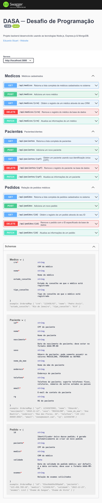

# Desafio Técnico - DASA
## Relatório

### Projeto iniciado em 04/09/2021 
### Desenvolvido por Eduardo Stuart | https://eduardostuart.pro.br

---

## Índice

* [Objetivo](#objetivo)
* [Executando o Projeto](#executando)
* [Implementação](#implementacao)
* [Técnicas](#tecnicas)
* [Testes](#testando)
* [Enunciado Original](#final)

---

<a name="objetivo"></a>
### Objetivo:

Desenvolver uma API para cadastro de pedidos médicos de pacientes.

Todas as especificações do projeto podem ser encontradas no [final desse relatório](#final).

---

<a name="executando"></a>
## Executando o Projeto

### Requisitos mínimos

Para testar o projeto, será preciso ter os seguintes componentes instalados:

- **Node.js**
  - A versão usada foi a **16.8**
  - Um guia detalhado de como instalar/atualizar o Node pode ser encontrado no [site oficial](https://nodejs.org/)
- **Docker**
  - A versão usada foi a **20.10.8**, mas deve funcionar em versões anteriores
  - Se ainda não tiver o Docker em sua máquina, [visite o site oficial](https://www.docker.com/get-started) para obter maiores instruções sobre como instalar
- **Docker-Compose**
  - A versão usada foi a **1.29.2**, mas deve funcionar em versões anteriores
  - Detalhes sobre instalação dessa ferramenta podem ser encontrados nessa seção do [site oficial](https://docs.docker.com/compose/install/)


### Clonando o Repositório

Para clonar o repositório contendo os arquivos desse projeto, siga os seguintes passos:

  - *__PS__: os comandos a seguir estão levando em consideração uma máquina __Linux__. Se estiver usando um sistema operacional diferente, pode ser necessário consultar a ajuda do seu SO.*

  - *__PS2__: as linhas que começam com '#' não devem ser digitadas no terminal ─ elas servem apenas para esclarecer o que os comandos estão fazendo.*

```bash
# Na sua pasta pessoal, crie uma subpasta chamada dasa
cd ~
mkdir dasa && cd dasa
# Clone o repositório que está abrigando os arquivos desse projeto
# Observe que a linha termina com um ponto após o nome do repositório
git clone git@github.com:eduardo-stuart/DASA.git .
# Para uma maior comodidade, o banco de dados MongoDB, necessário para a execução do projeto, 
# irá rodar via um container no Docker. Digite o seguinte comando para iniciar a sua operação
sudo docker-compose up -d
# Terminada essa operação, instale as demais dependências do projeto
sudo npm install
# O último passo: rodar o projeto
npm start
```

### Testando

Com o projeto em execução, abra o seu navegador e visite o endereço [localhost:3000](localhost:3000). Você será apresentado à documentação da API, onde estão listados os **_endpoints_**, como usá-los, os tipos de dados que eles trabalham, etc.



Além disso, é possível interagir com a API diretamente nessas paǵinas, acrescentando registros, consultando as listas, etc.

---

<a name="implementacao"></a>
## Implementação

O projeto foi desenvolvido usando as seguintes tecnologias:

* Linguagem: Typescript (v4.4.2)
* Ambimente: Node.js (v16.8.0)
* Frameworks: 
    - Express.js (v4.17.1)
    - Mongoose (v6.0.4)
    - Mocha (v9.1.1)
* Banco de dados: MongoDB
* Documentação: Swagger-jsdoc (v6.1.0)

---
<a name="tecnicas"></a>

## Técnicas Usadas

O projeto adotou as principais boas práticas de desenvolvimento de software:

- Programação Orientada a Objetos
  - Herança
  - Polimorfismo
  - Encapsulamento
- Padrões de Projeto
  - Singleton
  - Middleware
  - SOLID
  - DRY
---

<a name="testando"></a>
## Testes Unitários

O projeto inclui **20 testes unitários**. 

Para os testes, foi utilizado o framework [Mocha](https://mochajs.org/), em conjunto com o [Chai](http://chaijs.com/) e o [SUPERTEST](https://www.npmjs.com/package/supertest).

Para rodar os testes automatizados, use o seguinte comando:

```bash
npm run test
``` 


---

<a name="final"></a>

## Detalhes do Projeto

O desafio consistia no seguinte enunciado:

### REQUISITOS DE NEGÓCIO

- Os dados do paciente devem ser: Nome, Data de nascimento, Sexo, Nome da Mae, Endereço, Contato (Telefone, email) e Documento (CPF, RG).

- Os dados do medico devem ser: Nome, Numero do conselho, Estado do conselho e Tipo do conselho.

- Os dados do pedido medico devem ser: Exames solicitados e Data de validade.

- A estrutura desses dados é com você!

### REQUISITOS TÉCNICOS

- API RESTful

- Possuir uma interface para visualização simples dos dados, telas, web, swagger, etc.

- Documentação clara e bem organizada, com uma sequência de instruções para executar a aplicação.

- Implementar testes unitários.

### SUGESTÕES

- A linguagem de programação pode ser Java, Node(typescript), Python.

- Docker é bem vindo!

---

Projeto desenvolvido entre 04/09/2021 e 06/09/2021 | <https://eduardostuart.pro.br>